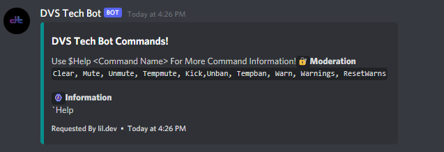
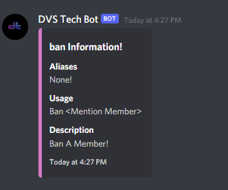
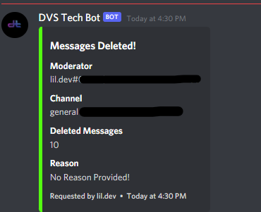

# DVS Tech Moderation Bot

DVS Tech Moderation Bot Free Version For Discord Source Code

v1.0.0

## Contributing

Contributions are always welcome!

See `contributing.md` for ways to get started.

Please adhere to this project's `code of conduct`.


## Features

- Ban
- Kick
- Clear
- Mute
- Unmute
- Unban
- Warn
- Warnings

Note : Read LICENSE before use of any of DVS Tech Open Source Projects

Download Links Alternatives : Visit DVS Tech App Store and Get the Latest Stable Build

## Deployment

Clone the project

```bash
  git clone https://github.com/DVS-Tech-Open-Source-Projects/DVS-Tech-Moderation-Bot.git
```

Go to the project directory

```bash
  cd DVS-Tech-Moderation-Bot
```

Install dependencies

```bash
  npm install
```

Start the server

```bash
  node index.js
```
## Feedback

If you have any feedback, please reach out to us at devarshishimpi@gmail.com


## Support

For support, email devarshishimpi@gmail.com or join our Discord Server.

## Screenshots




